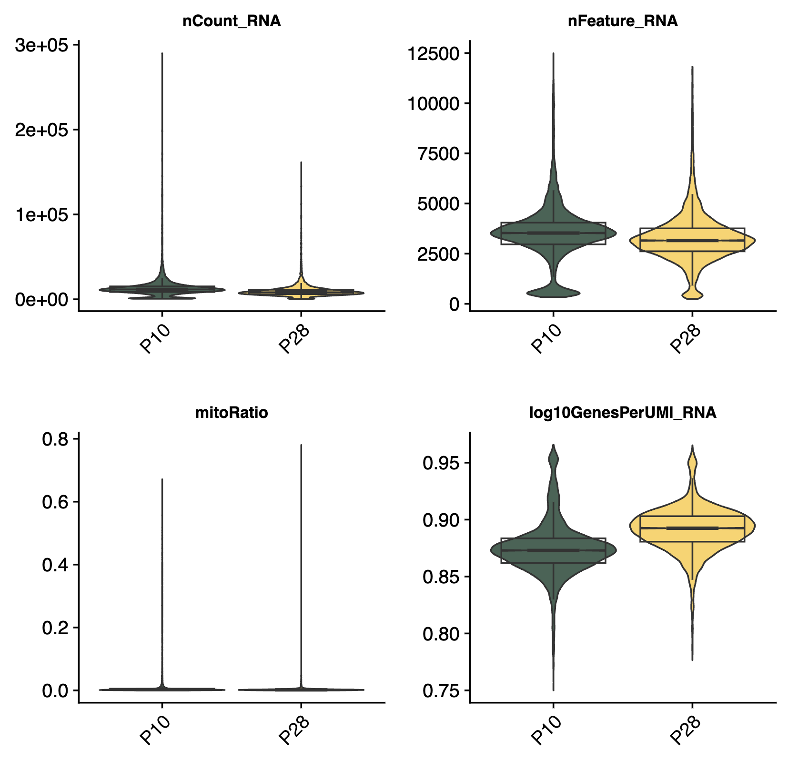
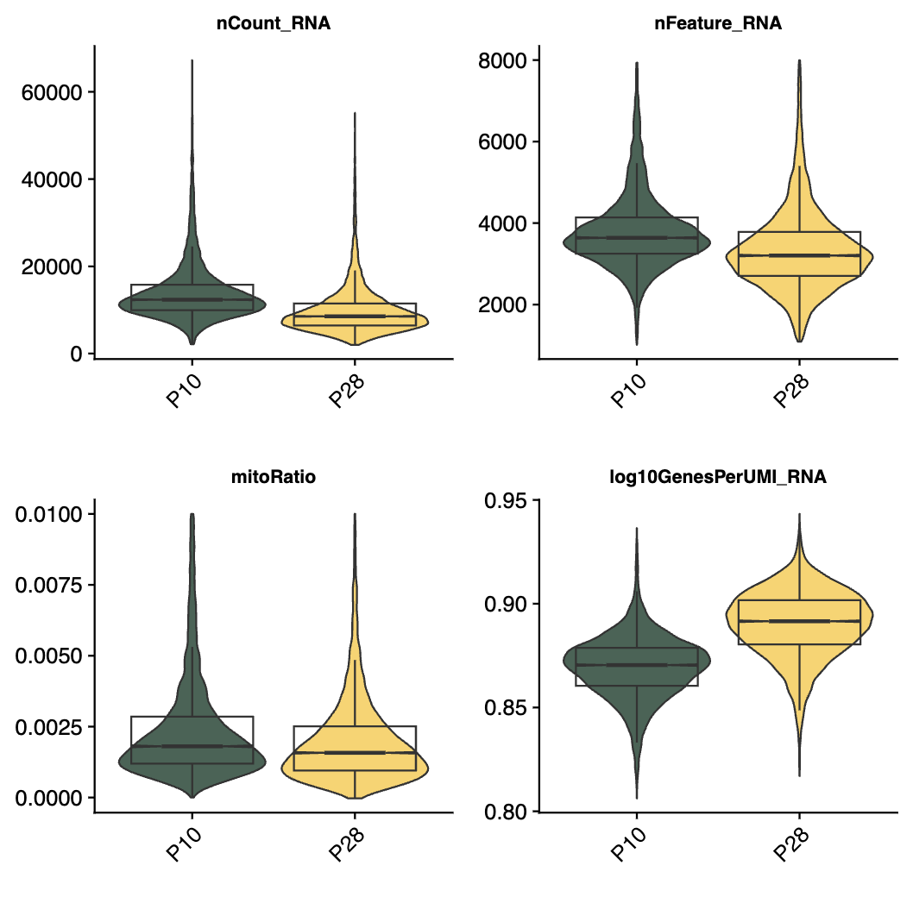
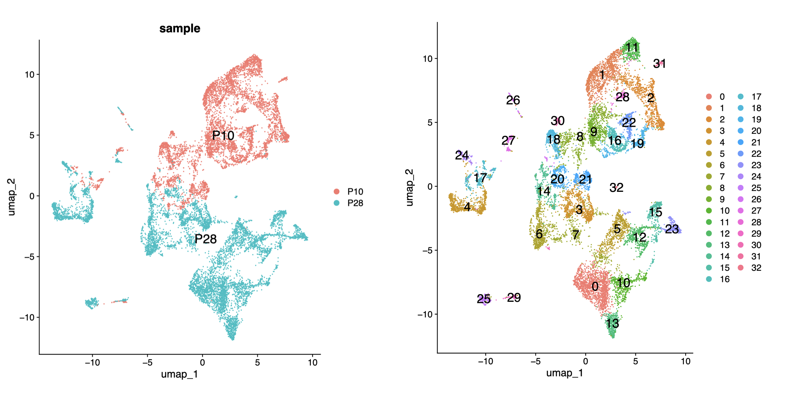
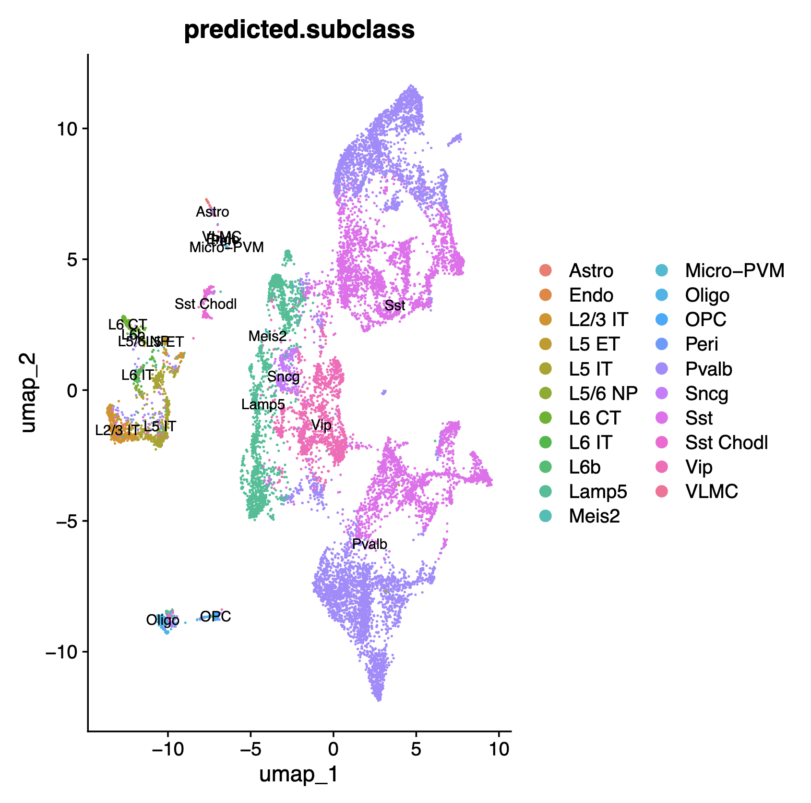

# snRNA Processing  

## Content

```
1_scRNA
├── README.md
├── code
│   ├── 01_mergeddata.R
│   └── 02_annotate.R
├── content
├── imag
│   ├── 2_quality_control_1stfilter.pdf
│   ├── 3_umaps.pdf
│   ├── 3_umaps_P10.pdf
│   └── 3_umaps_P28.pdf
└── results
    ├── 1_merged_seurat.rds
    ├── 2_seurat_filtered.rds
    ├── 3_seurat_annotated.rds
    ├── total_cells_per_subclass_all.csv
    ├── total_cells_per_subclass_p10.csv
    └── total_cells_per_subclass_p28.csv
```

## Liana Workflow

### 0. Load the data
DOI: https://doi.org/10.1016/j.neuron.2023.05.032
- Data p10: GSM5014306 
- Data p28: GSM5014308

```
├── GSM5014306_P10
│   ├── GSM5014306_P10_V1_Dlxpos_RNA_barcodes.tsv
│   ├── GSM5014306_P10_V1_Dlxpos_RNA_features.tsv
│   └── GSM5014306_P10_V1_Dlxpos_RNA_matrix.mtx
└── GSM5014308_P28
    ├── GSM5014308_P28_V1_Dlxpos_RNA_barcodes.tsv
    ├── GSM5014308_P28_V1_Dlxpos_RNA_features.tsv
    └── GSM5014308_P28_V1_Dlxpos_RNA_matrix.mtx
```

### 1. Create Seurat for each sample 
```
> GSM5014306_P10
An object of class Seurat 
31053 features across 7246 samples within 1 assay 
Active assay: RNA (31053 features, 0 variable features)
 1 layer present: counts
 
> GSM5014308_P28
An object of class Seurat 
31053 features across 8571 samples within 1 assay 
Active assay: RNA (31053 features, 0 variable features)
 1 layer present: counts
```

### 2. Merge into one seurat object
```
An object of class Seurat 
31053 features across 15817 samples within 1 assay 
Active assay: RNA (31053 features, 0 variable features)
 2 layers present: counts.1, counts.2


                                     orig.ident nCount_RNA nFeature_RNA
GSM5014306_P10_AAACCCAAGACGCCAA-1 SeuratProject      16777         4308
GSM5014306_P10_AAACCCAAGGCCTTGC-1 SeuratProject       6080         2634
GSM5014306_P10_AAACCCACAGTGCCTG-1 SeuratProject      15234         4184
GSM5014306_P10_AAACCCATCAGCGCAC-1 SeuratProject      22537         5134
GSM5014306_P10_AAACCCATCTGCGGAC-1 SeuratProject       4147         2071
GSM5014306_P10_AAACGAAAGCTGACCC-1 SeuratProject      14185         4021
```

### 3. Add info to metadata

- `log10GenesPerUMI_RNA`
- `mitoRatio`
- `sample`

```
orig.ident nCount_RNA nFeature_RNA
GSM5014306_P10_AAACCCAAGACGCCAA-1 SeuratProject      16777         4308
GSM5014306_P10_AAACCCAAGGCCTTGC-1 SeuratProject       6080         2634
GSM5014306_P10_AAACCCACAGTGCCTG-1 SeuratProject      15234         4184
GSM5014306_P10_AAACCCATCAGCGCAC-1 SeuratProject      22537         5134
GSM5014306_P10_AAACCCATCTGCGGAC-1 SeuratProject       4147         2071
GSM5014306_P10_AAACGAAAGCTGACCC-1 SeuratProject      14185         4021
                                  log10GenesPerUMI_RNA    mitoRatio sample
GSM5014306_P10_AAACCCAAGACGCCAA-1            0.8602418 0.0013709245    P10
GSM5014306_P10_AAACCCAAGGCCTTGC-1            0.9039913 0.0034539474    P10
GSM5014306_P10_AAACCCACAGTGCCTG-1            0.8658266 0.0009846396    P10
GSM5014306_P10_AAACCCATCAGCGCAC-1            0.8524108 0.0013755158    P10
GSM5014306_P10_AAACCCATCTGCGGAC-1            0.9166456 0.0168796721    P10
GSM5014306_P10_AAACGAAAGCTGACCC-1            0.8681316 0.0095875925    P10
```

### 4. Visualize the data without filtering 



### 5. Filtering

```
nCount_min_filt <- 2000
nCount_max_filt <- 7000
nFeature_min_filt <- 1000
nFeature_max_filt <- 8000
mitoRatio_filt <- 0.01

An object of class Seurat 
31053 features across 14438 samples within 1 assay 
Active assay: RNA (31053 features, 0 variable features)
 2 layers present: counts.1, counts.2
> table(filtered_seurat$sample)

 P10  P28 
6323 8115 
```



### 6. Normalize, Find Most Variable Genes, Scale, PCA, Neighbors, UMAP

```
seurat_obj <- NormalizeData(seurat_obj)
seurat_obj <- FindVariableFeatures(seurat_obj, 
                    selection.method = "vst",
                    nfeatures = 2000, 
                    verbose = FALSE)
seurat_obj <- ScaleData(seurat_obj)
seurat_obj <- RunPCA(seurat_obj)
seurat_obj <- FindNeighbors(seurat_obj, dims = 1:30, reduction='pca')
seurat_obj <- RunUMAP(seurat_obj,dims=1:30,min.dist=0.3,reduction='pca',reduction.name = 'umap')
```



### 7. Annotate with Azimuth

```
seurat_obj[["RNA"]] <- JoinLayers(seurat_obj[["RNA"]])
seurat_obj <- Azimuth::RunAzimuth(seurat_obj, 
          reference = "mousecortexref")

```



