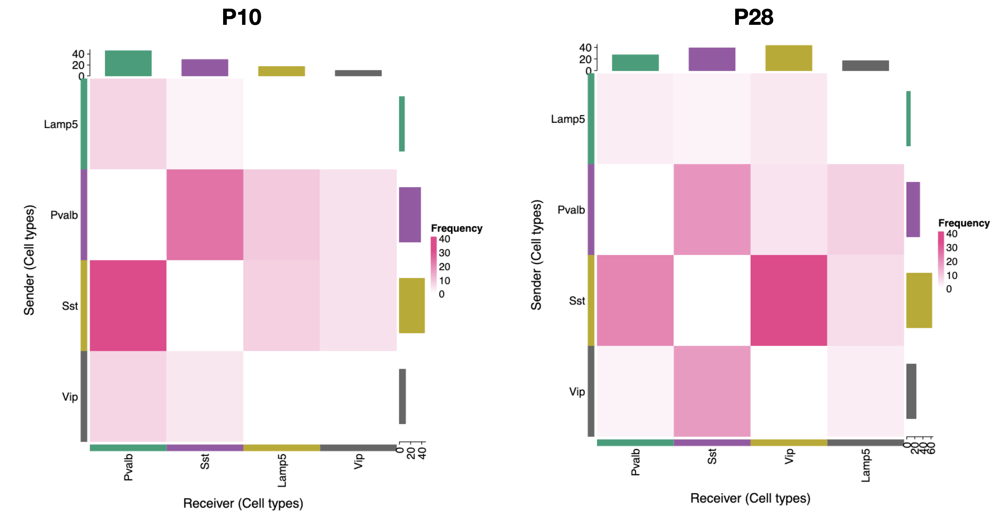

# Liana 

## Content

```
2_liana
  ├── README.md
  ├── code
  │   ├── 03_liana_bootstrapping_P10.R
  │   ├── 03_liana_bootstrapping_P28.R
  │   └── bootstrapping_functions.R
  ├── content
  ├── imag
  └── results
```

## Liana Workflow


### 1. Load annotated Seurat Object

The seurat object should contain a column with the annotated cell type

|                  **orig.ident**                 | **nCount_RNA** | **nFeature_RNA** | **seurat_annotations** |
|:-----------------------------------------------:|:--------------:|:----------------:|:----------------------:|
| GSM5014306_P10_AAACCCAAGACGCCAA-1 SeuratProject |      16777     |       4308       |          Pvalb         |
| GSM5014306_P10_AAACCCAAGGCCTTGC-1 SeuratProject |      6080      |       2634       |          Chodl         |
| GSM5014306_P10_AAACCCACAGTGCCTG-1 SeuratProject |      15234     |       4184       |           Sst          |
| GSM5014306_P10_AAACCCATCAGCGCAC-1 SeuratProject |      22537     |       5134       |           Sst          |
| GSM5014306_P10_AAACCCATCTGCGGAC-1 SeuratProject |      4147      |       2071       |           OPC          |
| GSM5014306_P10_AAACGAAAGCTGACCC-1 SeuratProject |      14185     |       4021       |           Sst          |

### 2. Create separate objects for cells of interest
- `🔵 Lamp5`  
- `🟣 Sst`  
- `🟠 Vip`  
- `🟢 Pvalb`  

| **Cell Type** | **All** | **P10** | **P28** |
|:-------------:|:-------:|:-------:|:-------:|
|     Pvalb     |   5025  |   2221  |   2804  |
|      Sst      |   4377  |   2501  |   1876  |
|     Lamp5     |   1574  |   647   |   927   |
|      Vip      |   1521  |   515   |   1006  |
```
Lamp5 <- subset(p10, predicted.subclass == "Lamp5")
Pvalb <- subset(p10, predicted.subclass == "Pvalb")
Vip <- subset(p10, predicted.subclass == "Vip")
Sst <- subset(p10, predicted.subclass == "Sst")
```


### 3. Bootstapping 

1. Sample n cells m times (in this analysis, m=100) and create a list for each cell subtype of interest
2. Loop 100 times and merge one item of the list per subtype of interest 
3. Call `liana_wrap` on this 100 merged objects using 3 methods: `call_cellchat`, `cellphonedb`, and `sca`

Output from this step is an object that contains the results of the 100 tests using the 3 methods 
```
[[1]]$call_cellchat
# A tibble: 110 × 6
   source target ligand receptor   prob  pval
   <fct>  <fct>  <chr>  <chr>     <dbl> <dbl>
 1 Lamp5  Lamp5  L1cam  Egfr     0.0134  0   
 2 Pvalb  Lamp5  L1cam  Egfr     0.0124  0   
 3 Sst    Lamp5  L1cam  Egfr     0.0283  0   
 4 Vip    Lamp5  L1cam  Egfr     0.0164  0 
 
[[1]]$cellphonedb
# A tibble: 50,192 × 13
   source target ligand.complex ligand  receptor.complex receptor receptor.prop
   <chr>  <chr>  <chr>          <chr>   <chr>            <chr>            <dbl>
 1 Lamp5  Lamp5  Adam10         Adam10  Tspan12          Tspan12          0.188
 2 Lamp5  Lamp5  Adam10         Adam10  Met              Met              0.174
 3 Lamp5  Lamp5  Adam10         Adam10  Epha3            Epha3            0.978
 4 Lamp5  Lamp5  Adam10         Adam10  Nrcam            Nrcam            0.922
   ligand.prop ligand.expr receptor.expr lrs.to.keep lr.mean pvalue
         <dbl>       <dbl>         <dbl> <lgl>         <dbl>  <dbl>
 1       0.722      0.681         0.0827 TRUE          0.382  0    
 2       0.722      0.681         0.0492 TRUE          0.365  0    
 3       0.722      0.681         1.29   TRUE          0.985  0.716
 4       0.722      0.681         0.0632 TRUE          0.372  0 

[[1]]$sca
# A tibble: 50,192 × 13
   source target ligand.complex ligand  receptor.complex receptor receptor.prop
   <chr>  <chr>  <chr>          <chr>   <chr>            <chr>            <dbl>
 1 Lamp5  Lamp5  Adam10         Adam10  Tspan12          Tspan12          0.188
 2 Lamp5  Lamp5  Adam10         Adam10  Met              Met              0.174
 3 Lamp5  Lamp5  Adam10         Adam10  Epha3            Epha3            0.978
 4 Lamp5  Lamp5  Adam10         Adam10  Nrcam            Nrcam            0.922
   ligand.prop ligand.expr receptor.expr global_mean lrs.to.keep LRscore
         <dbl>       <dbl>         <dbl>       <dbl> <lgl>         <dbl>
 1       0.722      0.681         0.0827       0.145 TRUE          0.621
 2       0.722      0.681         0.0492       0.145 TRUE          0.558
 3       0.722      0.681         1.29         0.145 TRUE          0.866
 4       0.722      0.681         0.0632       0.145 TRUE          0.589

```

### 4. Remove self interactions `bootstrap_keep_dir`

Iterate through 3 different methods results (`call_cellchat`, `cellphonedb`, and `sca`) in the list of 100 items and remove the rows where `source == target`. This means that the interaction originates from and targets the same cell, and in this analysis, we are not interested in those types of interactions.

We only keep interactions from one cell to another. This are the 6 possible combiantions we have:

- `🔵🟣 Lamp5_Sst`  
- `🔵🟢 Lamp5_Pvalb`  
- `🔵🟠 Lamp5_Vip`  
- `🟢🟣 Pvalb_Sst` 
- `🟢🟠 Pvalb_Vip` 
- `🟠🟣 Vip_Sst` 


```
Lamp5_Sst_bootstrap_dir <- bootstrap_keep_dir(LIANA_bootstrap, "Lamp5", "Sst", 3)
Lamp5_Pvalb_bootstrap_dir <- bootstrap_keep_dir(LIANA_bootstrap, "Lamp5", "Pvalb", 3)
Lamp5_Vip_bootstrap_dir <- bootstrap_keep_dir(LIANA_bootstrap, "Lamp5", "Vip", 3)
Pvalb_Sst_bootstrap_dir <- bootstrap_keep_dir(LIANA_bootstrap, "Pvalb", "Sst", 3)
Pvalb_Vip_bootstrap_dir <- bootstrap_keep_dir(LIANA_bootstrap, "Pvalb", "Vip", 3)
Vip_Sst_bootstrap_dir <- bootstrap_keep_dir(LIANA_bootstrap, "Vip", "Sst", 3)
```
### 5. Remove Duplicates `remove_duplicates_from_lists`
```
Lamp5_Sst_bootstrap_dir_nodup <- remove_duplicates_from_lists(Lamp5_Sst_bootstrap_dir)
Lamp5_Pvalb_bootstrap_dir_nodup <- remove_duplicates_from_lists(Lamp5_Pvalb_bootstrap_dir)
Lamp5_Vip_bootstrap_dir_nodup <- remove_duplicates_from_lists(Lamp5_Vip_bootstrap_dir)
Pvalb_Sst_bootstrap_dir_nodup <- remove_duplicates_from_lists(Pvalb_Sst_bootstrap_dir)
Pvalb_Vip_bootstrap_dir_nodup <- remove_duplicates_from_lists(Pvalb_Vip_bootstrap_dir)
Vip_Sst_bootstrap_dir_nodup <- remove_duplicates_from_lists(Vip_Sst_bootstrap_dir)
```

### 6. Aggregate `aggregate_dir_inter`

Now we have 100 tibbles like this with the aggregated score for the 3 methods used:
```
# A tibble: 5,422 × 12
   source target ligand receptor aggregate_rank mean_rank call_cellchat.pval
   <chr>  <chr>  <chr>  <chr>             <dbl>     <dbl>              <dbl>
 1 Sst    Lamp5  Nrg3   Egfr           0.000185      49.5               0   
 2 Lamp5  Sst    L1cam  Cntn1          0.000209      86                 0.44
 3 Sst    Lamp5  L1cam  Egfr           0.000380      96.5               0   
 4 Sst    Lamp5  Tnr    Itga9          0.000636     106.                0   
 5 Sst    Lamp5  Sema3a Nrp2           0.00152      127.                0   
 6 Sst    Lamp5  Lama4  Itga9          0.00227      138.                0   
 7 Sst    Lamp5  Nxph1  Nrxn1          0.00292     1849                NA   
 8 Lamp5  Sst    Jam3   Itgb1          0.00367      155.                0   
 9 Lamp5  Sst    Vegfc  Itgb1          0.00391      157.                0   
10 Sst    Lamp5  Vegfc  Itgb1          0.00501      245.                0.06
   call_cellchat.rank cellphonedb.pvalue cellphonedb.rank sca.LRscore sca.rank
                <dbl>              <dbl>            <dbl>       <dbl>    <dbl>
 1                7.5              0                  127       0.945       14
 2               17                0                  127       0.858      114
 3                7.5              0                  127       0.833      155
 4                7.5              0                  127       0.806      184
 5                7.5              0                  127       0.758      246
 6                7.5              0                  127       0.732      281
 7             5419                0                  127       0.963        1
 8                7.5              0                  127       0.695      330
 9                7.5              0                  127       0.691      337
10               15                0.177              353       0.677      366
```

### 7. Add column with string source-target-ligand-receptor `add_inter_col`

To be able to differentiate interaction direction we add column with string source-target-ligand-receptor
```
> Lamp5_Sst_bootstrap_agg[[1]] %>%
print(width=Inf)
# A tibble: 5,422 × 13
   source target ligand receptor aggregate_rank mean_rank call_cellchat.pval
   <chr>  <chr>  <chr>  <chr>             <dbl>     <dbl>              <dbl>
 1 Sst    Lamp5  Nrg3   Egfr           0.000185      49.5               0   
 2 Lamp5  Sst    L1cam  Cntn1          0.000209      86                 0.44
 3 Sst    Lamp5  L1cam  Egfr           0.000380      96.5               0   
 4 Sst    Lamp5  Tnr    Itga9          0.000636     106.                0   
 5 Sst    Lamp5  Sema3a Nrp2           0.00152      127.                0   
 6 Sst    Lamp5  Lama4  Itga9          0.00227      138.                0   
 7 Sst    Lamp5  Nxph1  Nrxn1          0.00292     1849                NA   
 8 Lamp5  Sst    Jam3   Itgb1          0.00367      155.                0   
 9 Lamp5  Sst    Vegfc  Itgb1          0.00391      157.                0   
10 Sst    Lamp5  Vegfc  Itgb1          0.00501      245.                0.06
   call_cellchat.rank cellphonedb.pvalue cellphonedb.rank sca.LRscore sca.rank
                <dbl>              <dbl>            <dbl>       <dbl>    <dbl>
 1                7.5              0                  127       0.945       14
 2               17                0                  127       0.858      114
 3                7.5              0                  127       0.833      155
 4                7.5              0                  127       0.806      184
 5                7.5              0                  127       0.758      246
 6                7.5              0                  127       0.732      281
 7             5419                0                  127       0.963        1
 8                7.5              0                  127       0.695      330
 9                7.5              0                  127       0.691      337
10               15                0.177              353       0.677      366
   interaction          
   <chr>                
 1 Sst-Lamp5-Nrg3-Egfr  
 2 Lamp5-Sst-L1cam-Cntn1
 3 Sst-Lamp5-L1cam-Egfr 
 4 Sst-Lamp5-Tnr-Itga9  
 5 Sst-Lamp5-Sema3a-Nrp2
 6 Sst-Lamp5-Lama4-Itga9
 7 Sst-Lamp5-Nxph1-Nrxn1
 8 Lamp5-Sst-Jam3-Itgb1 
 9 Lamp5-Sst-Vegfc-Itgb1
10 Sst-Lamp5-Vegfc-Itgb1
```

### 8. Filter to keep only values within pval treshold `filter_aggRank`
`aggregate_rank < 0.01`

### 9. Get vector with all possible interactions predicted in the 100 runs and get the percentage of presence in the bootstrapped results


1. For each cell combination we get all possible interactions `interactions_vector`
```
> Lamp5_Sst_interactions
 [1] "Sst-Lamp5-Nrg3-Egfr"     "Lamp5-Sst-L1cam-Cntn1"  
 [3] "Sst-Lamp5-L1cam-Egfr"    "Sst-Lamp5-Tnr-Itga9"    
 [5] "Sst-Lamp5-Sema3a-Nrp2"   "Sst-Lamp5-Lama4-Itga9"  
 [7] "Sst-Lamp5-Nxph1-Nrxn1"   "Lamp5-Sst-Jam3-Itgb1"   
 [9] "Lamp5-Sst-Vegfc-Itgb1"   "Sst-Lamp5-Vegfc-Itgb1"  
```

2. For each interaction we get the percentage of times it appears in the 100 tests we did `check_inter`
```
> robust_Lamp5_Sst
              interactions percentage
1      Sst-Lamp5-Nrg3-Egfr        100
2    Lamp5-Sst-L1cam-Cntn1         99
3     Sst-Lamp5-L1cam-Egfr         99
4      Sst-Lamp5-Tnr-Itga9        100
5    Sst-Lamp5-Sema3a-Nrp2         93
```


3. Separate interactoins going from cell1 -> cell2 vs cell1 <- cell2 
```
robust_Lamp5toSst <- robust_Lamp5_Sst[startsWith(robust_Lamp5_Sst$interactions, "L"), ] 
robust_SsttoLamp5 <- robust_Lamp5_Sst[startsWith(robust_Lamp5_Sst$interactions, "S"), ] 
```


### 10. Keep only interactions that appeared above treshold set

```
robust_Lamp5toSst_vecfilt <- subset(robust_Lamp5toSst, subset = robust_Lamp5toSst$percentage >= 75)
robust_SsttoLamp5_vecfilt <- subset(robust_SsttoLamp5, subset = robust_SsttoLamp5$percentage >= 75)
```


### 11. Subset the bootstrapped results for cell direction and then randomly select 1 out of the 100 results predicted `keep_specific_inter`

```
robust_Lamp5toSst_agg <- keep_specific_inter(Lamp5_Sst_bootstrap_agg_filt, robust_Lamp5toSst_vecfilt$interactions) 
robust_Lamp5toSst_agg_df <- robust_Lamp5toSst_agg[[sample(1:100, 1)]]
```

### 12. Plot and explore results


### 13. Biological Interpretation


## References


Installation: https://saezlab.github.io/liana/  
Paper: https://www.biorxiv.org/content/10.1101/2023.08.19.553863v1.full  
Tutorial: https://saezlab.github.io/liana/articles/liana_tutorial.html

