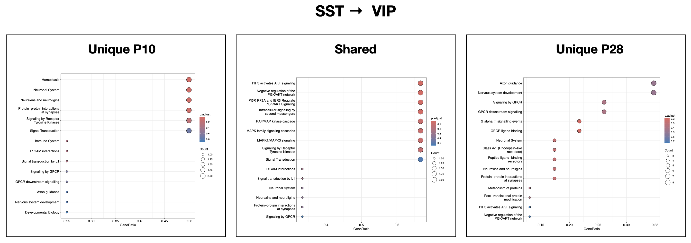

# Functional Characterization 

## Content

```
3_functionalcharacterization
  ├── code
  │   ├── FunChar_Sst_Pvalb.R
  │   └── FunChar_Sst_Vip.R
  ├── content
  ├── imag
  │   └── SST_VIP
  └── README.md

```

##  Workflow SST-VIP

### 1. Load LIANA outputs of final robust interactions

```
robust_all_df_p10 <- read.csv(paste0(basepath, "2_liana/results/robust_all_df_p10.csv"))
robust_all_df_p28 <- read.csv(paste0(basepath, "2_liana/results/robust_all_df_p28.csv"))
```


```
> head(robust_all_df_p10)
  source target ligand receptor aggregate_rank  mean_rank call_cellchat.pval
1  Lamp5    Sst  L1cam    Cntn1   0.0001857196   86.66667               0.43
2  Lamp5    Sst   Jam3    Itgb1   0.0037766857  153.83333               0.00
3  Lamp5    Sst  Vegfc    Itgb1   0.0041634512  157.50000               0.00
4  Lamp5    Sst  Nxph1    Nrxn1   0.0058327916 1921.00000                 NA
5  Lamp5  Pvalb  L1cam    Cntn1   0.0018684714  139.83333               0.63
6  Lamp5  Pvalb  Lamc1    Itga9   0.0026755554  141.16667               0.00
  call_cellchat.rank cellphonedb.pvalue cellphonedb.rank sca.LRscore sca.rank
1               17.0              0.000            122.0   0.8537607      121
2                6.5              0.000            122.0   0.6924550      333
3                6.5              0.000            122.0   0.6852910      344
4             5434.0              0.096            327.0   0.9590056        2
5               20.0              0.007            263.5   0.8453654      136
6                9.0              0.000            117.5   0.7186082      297
              interaction
1   Lamp5-Sst-L1cam-Cntn1
2    Lamp5-Sst-Jam3-Itgb1
3   Lamp5-Sst-Vegfc-Itgb1
4   Lamp5-Sst-Nxph1-Nrxn1
5 Lamp5-Pvalb-L1cam-Cntn1
6 Lamp5-Pvalb-Lamc1-Itga9
```


### 2. Create separe objects  for interactions of sub-types of interest, considering the direction of interactions 

```
SSTtoVIP_p10 <- subset(robust_all_df_p10, robust_all_df_p10$source == "Sst" & robust_all_df_p10$target == "Vip")
SSTtoVIP_p28 <- subset(robust_all_df_p28, robust_all_df_p28$source == "Sst" & robust_all_df_p28$target == "Vip")
VIPtoSST_p10 <- subset(robust_all_df_p10, robust_all_df_p10$source == "Vip" & robust_all_df_p10$target == "Sst")
VIPtoSST_p28 <- subset(robust_all_df_p28, robust_all_df_p28$source == "Vip" & robust_all_df_p28$target == "Sst")


```


### 3. Visualize number of unique and shared interactions across the two stages of developemnt p10 and p28 for the two directions

```
#--- Sst -> Vip 
x <- list(p10 = SSTtoVIP_p10$interaction,
          p28 = SSTtoVIP_p28$interaction)
ggVennDiagram(x[1:2], label = "count", label_alpha = 0, set_size = 6,label_size = 6) + 
  scale_fill_gradient(low = "#F4FAFE", high = "maroon2") +  theme(legend.title = element_text(color = "black"), legend.position = "bottom") + coord_flip()

#----  Vip -> Sst
x <- list(p10 = VIPtoSST_p10$interaction,
          p28 = VIPtoSST_p28$interaction)
ggVennDiagram(x[1:2], label = "count", label_alpha = 0, set_size = 6,label_size = 6) + 
  scale_fill_gradient(low = "#F4FAFE", high = "maroon2") +  theme(legend.title = element_text(color = "black"), legend.position = "bottom") + coord_flip()
```


### 4. Subset LIANA output for unique (P10 or P28) and shared interactions 
```
#--- SST to VIP

## UNIQUE to p10 (left side of ven plot = 2)
unique_pairs_SSTtoVIP_p10_inter <- Reduce(setdiff, list(A = SSTtoVIP_p10$interaction, B = SSTtoVIP_p28$interaction))
unique_pairs_SSTtoVIP_p10_df <- subset(SSTtoVIP_p10, SSTtoVIP_p10$interaction %in% unique_pairs_SSTtoVIP_p10_inter)

## UNIQUE to p28 (right side of ven = 31)
unique_pairs_SSTtoVIP_p28_inter <- Reduce(setdiff, list(A = SSTtoVIP_p28$interaction, B = SSTtoVIP_p10$interaction))
unique_pairs_SSTtoVIP_p28_df <- subset(SSTtoVIP_p28, SSTtoVIP_p28$interaction %in% unique_pairs_SSTtoVIP_p28_inter)

## SHARED (middle of ven = 3)
unique_pairs_SSTtoVIP_shared_inter <- intersect(SSTtoVIP_p10$interaction, SSTtoVIP_p28$interaction)
unique_pairs_SSTtoVIP_shared_df <- subset(SSTtoVIP_p28, SSTtoVIP_p28$interaction %in% unique_pairs_SSTtoVIP_shared_inter)

#--- VIP to SST 
## UNIQUE to p10 (left side of ven plot = 3)
unique_pairs_VIPtoSST_p10_inter <- Reduce(setdiff, list(A = VIPtoSST_p10$interaction, B = VIPtoSST_p28$interaction))
unique_pairs_VIPtoSST_p10_df <- subset(VIPtoSST_p10, VIPtoSST_p10$interaction %in% unique_pairs_VIPtoSST_p10_inter)

## UNIQUE to p28 (right side of ven plot = 18)
unique_pairs_VIPtoSST_p28_inter <- Reduce(setdiff, list(A = VIPtoSST_p28$interaction, B = VIPtoSST_p10$interaction))
unique_pairs_VIPtoSST_p28_df <- subset(VIPtoSST_p28, VIPtoSST_p28$interaction %in% unique_pairs_VIPtoSST_p28_inter)

## no SHARED interactions in VIP to SST
```

### 5. Visualize data as dotplot `liana_dotplot`

```
names(unique_pairs_SSTtoVIP_p10_df)[3] <- paste("ligand.complex")  ### rename cols ligand to ligand.complex
names(unique_pairs_SSTtoVIP_p10_df)[4] <- paste("receptor.complex") 
liana_dotplot(unique_pairs_SSTtoVIP_p10_df, specificity = "cellphonedb.pvalue", source_groups = c("Sst", "Vip"), target_groups =  c("Sst", "Vip"))

names(unique_pairs_SSTtoVIP_shared_df)[3] <- paste("ligand.complex")
names(unique_pairs_SSTtoVIP_shared_df)[4] <- paste("receptor.complex")
liana_dotplot(unique_pairs_SSTtoVIP_shared_df, specificity = "cellphonedb.pvalue", source_groups = c("Sst", "Vip"), target_groups =  c("Sst", "Vip"))

names(unique_pairs_SSTtoVIP_p28_df)[3] <- paste("ligand.complex")
names(unique_pairs_SSTtoVIP_p28_df)[4] <- paste("receptor.complex")
liana_dotplot(unique_pairs_SSTtoVIP_p28_df, specificity = "cellphonedb.pvalue", source_groups = c("Sst", "Vip"), target_groups =  c("Sst", "Vip"), ntop = 20)
```


### 6. ORA 

1. Get entrez id of all genes `allgenes`
2. Get entrez id for unique/shared interactions for specific time point (`unique_pairs_SSTtoVIP_p10`,`unique_pairs_SSTtoVIP_p28`,`shared_pairs_SSTtoVIP`)
3. Do `enrichPathway` 

```
allgenes <- unique(c(SSTtoVIP_p10$ligand, SSTtoVIP_p10$receptor,
                    SSTtoVIP_p28$ligand, SSTtoVIP_p28$receptor,
                    VIPtoSST_p10$ligand, VIPtoSST_p10$receptor,
                    VIPtoSST_p28$ligand, VIPtoSST_p28$receptor))
allgenes_entrez <- mapIds(org.Mm.eg.db, keys = allgenes, keytype = "SYMBOL", column = "ENTREZID") 


SSTtoVIP_p10_vectors <- paste(SSTtoVIP_p10$ligand, SSTtoVIP_p10$receptor, sep = "-")
SSTtoVIP_p28_vectors <- paste(SSTtoVIP_p28$ligand, SSTtoVIP_p28$receptor, sep = "-")

#--- SST to VIP
unique_pairs_SSTtoVIP_p10 <- Reduce(setdiff, list(A = SSTtoVIP_p10_vectors, B = SSTtoVIP_p28_vectors))
unique_pairs_SSTtoVIP_p28 <- Reduce(setdiff,list(A = SSTtoVIP_p28_vectors, B = SSTtoVIP_p10_vectors))
shared_pairs_SSTtoVIP <- intersect(SSTtoVIP_p10_vectors, SSTtoVIP_p28_vectors)

genes <- unique(unlist(strsplit(gene_pairs, "-")))
genes_entrez <- mapIds(org.Mm.eg.db, keys = genes, keytype = "SYMBOL", column = "ENTREZID", multiVals = "first")

  ePath <- enrichPathway(genes_entrez, universe = allgenes_entrez, organism = "mouse", pvalueCutoff = 1, pAdjustMethod = "none", qvalueCutoff = 1, minGSSize = 3, maxGSSize = 500, readable = FALSE)
  ePath_df <- data.frame(ePath)


```


