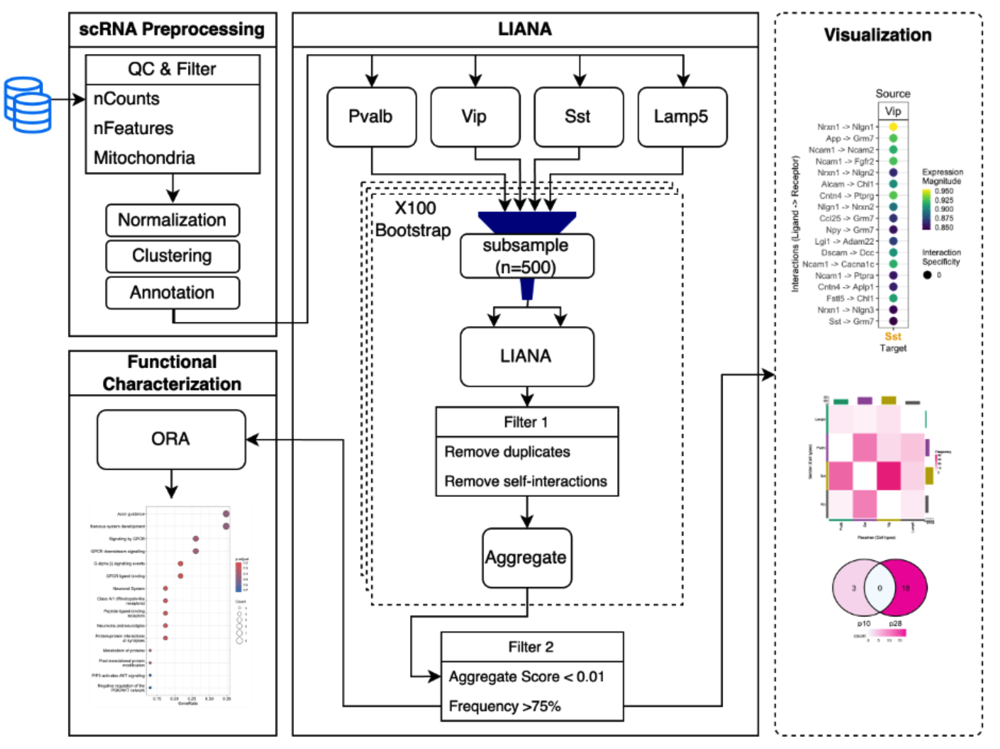

# Exploring Developmental Cell-to-Cell Interactions (CCI) within GABAergic interneurons

In this project, we use LIANA to predict the Ligand-Receptor interactions between different cell populations of the mouse visual cortex at two development stages P10 and P28.

Our analysis followed a three-step process: 

1. `1_scRNA` Preprocessing scRNAseq data 
2. `2_liana` Inferring CCI through a bootstrapped LIANA framework
3. `3_functionalcharacterization` Functional characterization and visualization results for downstream interpretation

### References

Dimitrov, D., Türei, D., Garrido-Rodriguez, M., Burmedi, P.L., Nagai, J.S., Boys, C., Ramirez Flores, R.O., Kim, H., Szalai, B., Costa, I.G. and Valdeolivas, A. Comparison of methods and resources for cell-cell communication inference from single-cell RNA-Seq data. Nature Communications, 13(1), p.3224 (2022)

Allaway, K. C. et al. Genetic and epigenetic coordination of cortical interneuron development. Nature 597, 693–697 (2021).