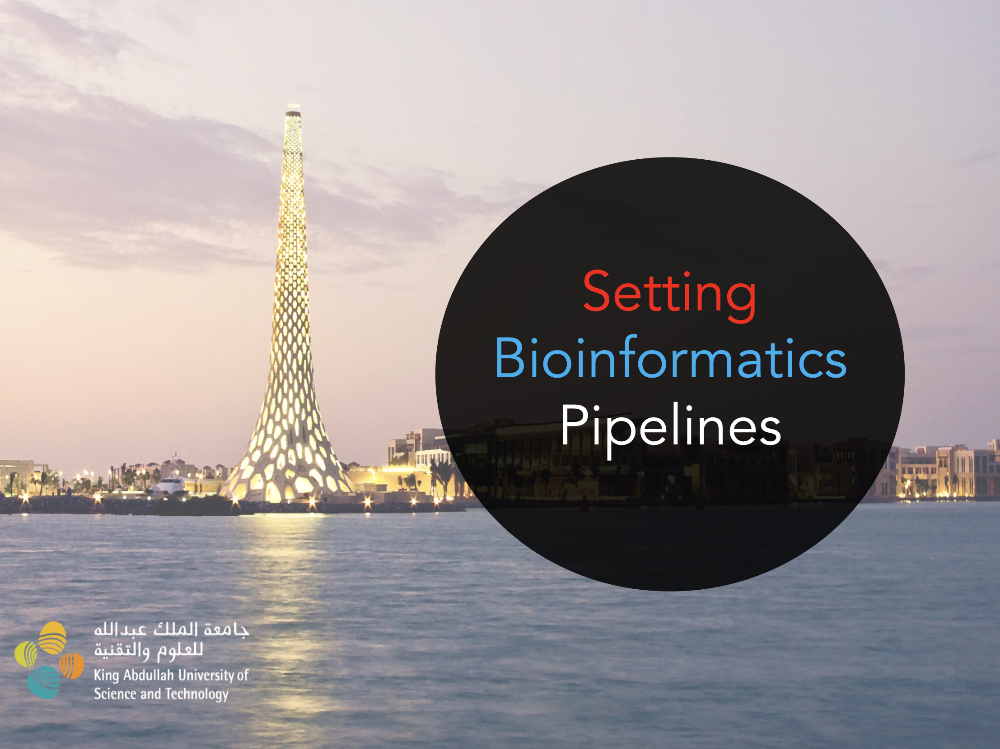

#  BESE 394A Setting Bioinformatic Pipelines 


## Summary 
|  Week  |    **Topic**    | **Assignments**                                                                                                              |
|:------:|:---------------:|------------------------------------------------------------------------------------------------------------------------------|
| **W1** |     RNA-seq     | GSE198256 Class Exercise Diff Expression<br>GSE132408 HW Diff Expression <br>RNA-seq Pipeline (Preprocess + Diff Expression) |
| **W2** |     RNA-seq     | GSE198256 Diff Expression + Gene Set Analysis                                                                                |
| **W3** |     ATAC-seq    | GSE79019 (Monocyte 3hs, 6hrs, 12hrs) Diff Accessibility                                                                      |
| **W4** |    scRNA-seq    | SnakeMake Preprocess scRNA + Diff Expression                                                                                 |
| **W5** |     Multiome    | ATAC + RNA Preprocess + DE + DA + Motif Analysis                                                                             |
| **W6** |   Integration   | scRNA + bulkATAC Integration                                                                                                 |
| **W7** | DNA Methylation | GSE188573 Quality Control, DMP, DVP, GREAT                                                                                   |
|        |     Project     | Liana: Cell to Cell interactions                                                                                             |


## Content

```
├── W1
│   ├── 1_ClassExercise
│   ├── 2_NewDataset
│   ├── 3_ppt
├── W2
│   ├── GSE198256_ANALYSIS_DAY2_GENESETCLUSTER.Rmd
│   ├── GSE198256_ANALYSIS_DAY2_GENESETCLUSTER.pdf
│   ├── GSE198256_report.R
│   ├── content
│   ├── data
├── W3
│   ├── Group3_homework.Rmd
│   ├── Group3_homework.html
│   └── paper.png
├── W4
│   ├── README.md
│   ├── _config.yml
│   ├── config
│   ├── test_data
│   └── workflow
├── W5
│   ├── Explore_data_Multi.R
│   ├── Plots
│   ├── W5_IndividualAssignment.pdf
│   ├── content
├── W6
│   ├── content
│   └── readme.md
├── W7
│   ├── README.md
│   ├── content
│   ├── group_ppt
│   └── meth.R
├── Project
│   ├── 1_scRNA
│   ├── 2_liana
│   ├── 3_functionalcharacterization


```