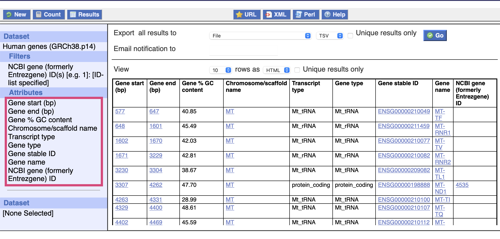

# W1: RNA-seq differential expression analysis. Class Exercise

 > Task: Compare “Results from JCI Insight” vs “Results derived from your own analysis”

## Overview

Severe COVID-19 disease is associated with dysregulation of the myeloid compartment during acute infection.

GSE198256

Data: https://www.ncbi.nlm.nih.gov/geo/query/acc.cgi?acc=GSE198256  
MetaData: GEOquery

Dataset: **GSE198256**  
Paper: **Functional reprogramming of monocytes in patients with acute and convalescent severe COVID-19**
10.1172/jci.insight.154183


|                                      | Number of Samples |                                                                         Samples                                                                        |
|:------------------------------------:|:-----------------:|:------------------------------------------------------------------------------------------------------------------------------------------------------:|
|              **Healthy**             |         10        | GSM5942339<br>GSM5942340<br>GSM5942341<br>GSM5942342<br>GSM5942343<br>GSM5942344<br>GSM5942345<br>GSM5942346<br>GSM5942347<br>GSM5942348<br>GSM5942349 |
| **Covid19: <br>Acute <br>Infection** |         6         | GSM5942350<br>GSM5942351<br>GSM5942352<br>GSM5942353<br>GSM5942354<br>GSM5942355<br>GSM5942356                                                         |
|    **Covid19:<br>Recovery<br>3Mo**   |         6         | GSM5942357<br>GSM5942358<br>GSM5942359<br>GSM5942360<br>GSM5942361<br>GSM5942362                                                                       |
|    **Covid19:<br>Recovery<br>6Mo**   |         10        | GSM5942363<br>GSM5942364<br>GSM5942365<br>GSM5942366<br>GSM5942367<br>GSM5942368<br>GSM5942369<br>GSM5942370<br>GSM5942371<br>GSM5942372             

## Workflow

### 1. Retreive data and metadata
1. Download counts from https://www.ncbi.nlm.nih.gov/geo/download/?format=file&type=rnaseq_counts -> `🔵GSE198256_count`
2. Using `GEOquery` we downlaod the metadata dor GSE198256 -> `🟡Meta_GSE198256`

### 2. Prep input for NOISeq

#### 2.1 Retrieve gene info from BIOMART
1. Save gene names into file  `data/biomart/entrez_id.csv`
2. Query from `BIOMART` https://asia.ensembl.org/info/data/biomart/index.html
    
3. Save the output into a file and read it in R `data/biomart/gene_info_mart_export_2.txt` ->  `🟣annotgene`
4. Rename cols so its easier to understand

#### 2.2 QC Filter `🟣annotgene`
5. Filter for chromosomes 1:22,X,Y, remove duplicates and remove na's


    |             | n_rows | n_unique | n_in_GSE198256 |
    |-------------------|--------|----------|----------------------|
    | original          | 286980 | 27339    | 25898                |
    | chromosome filter | 259500 | 27235    | 25872                |
    | duplicate removal | 27235  | 27235    | 25872                |
    | nas removal       | 27234  | 27234    | 25872                |

6. Set the column that cointains the entrez id in `🟣annotgene` (annotgene_filt$Entrezgene) as the rowname

#### 2.3 Filter `🔵GSE198256_count` 
7. Filter `🔵GSE198256_count` to only the entrez ids present in `🟣annotgene`
8. Reorder `🟣annotgene` to have the entrez ids in the same order as in `🔵GSE198256_count`. So `🔵GSE198256_count` and `🟣annotgene` contain the same 25,875 genes in the same order

#### 2.4 Extract cols for lenght, GC, biotype and chromosome

9. For the categories (lenght, GC, biotype, chromosome) we need a vector with all the values and entrez id. For chromosome we need ("Chromosome","start","end")

### 3. Run NOISEQ (Explore variability in the data)

```
data_NOISEQ <- readData(data = GSE198256_count_filt,
                        length=lengthuse,
                        gc=gc,
                        biotype= biotype ,
                        chromosome = annotgene_ord[,c("Chromosome","start","end")],
                        factors = Factors_GSE198256)
```


### 4. DESEQ2

1. Make sure rows in sample data `🟡pDataUSE` are in the same order as columns in counts `🔵GSE198256_count_filt`

2. Create DESeqDataSet object
3. QC and Filtering Keeping only rows with at least 10 reads
`14,055/25872`
4. Relevel factors make sure the reference is Healthy
5. Run DESeq
6. Explore results


## Results comparisson

In the principal component analysis we observed similar results to the ones reported by Brauns et al. with a clear separation between samples from acute and healthy controls.
For samples from patients who recovered from COVID-19 we also obtained that those from early recovery stage formed a distinct cluster, while those from a late recovery stage were found to be embedded within the control group. 

Our variance explained from PC1 = 41% and PC2 = 17%  was also similar to the ones reported by the authors (44% and 15% respectevely)


<figure>
    
    <figcaption> PCA plot representing the distinct clusters based on transcriptional profiles of monocytes from controls (n = 11), acute-infection (n = 7), early-recovery (n = 6), and late-recovery phases (n = 10). a) Results from the authors b) Results obtained by me.</figcaption>
</figure>


For the DEG's although we obtained a similar trend in the results - a higher number of DEG in the Acute and Early Recovery samples and a lower number in the Late Recovery - the number of genes we obtained differentially expressed was higher than the number they reported for all the conditions. This could be due to the different gene filtering parameters we set. While we filter for reads with more than 10 reads in at least 6 samples they removed genes with no read count higher than 20 in at least 1 sample.


|                |    **Reported Results**   |            **My Results**            |
|:--------------:|:-------------------------:|:------------------------------------:|
|      Acute     | 184 up<br>155 down | 369 (37%) up<br>639 (63%) down |
| Early Recovery | 318 up<br>203 down |  419 (51%) up<br>396 (49%) down  |
|  Late Recovery |      Hardly any DEGs      |   20 (83%)  up<br>4 (17%) down   |


We observed that for the acute samples the expression of genes associated to antigen processing and presentation of exogenous antigen is decreassed, in agreement with what the author reported. For early recovery samples we observed genes asociated chemokine and cytokine activity. The authors also reported multiple genes encoding chemokines were upregulated, along with important intracellular immunomodulatory proteins and transcription factors


|                |                                                                 Reported Results                                                                |                            My Results                            |   |
|:--------------:|:-----------------------------------------------------------------------------------------------------------------------------------------------:|:----------------------------------------------------------------:|:-:|
|      Acute     | immune pathways: antigenic presentation, innate <br>immune responses and MAPK and NF-κ<br>B signalling<br>metabolic processes: lipid metabolism | Antigen processing <br>and presentation of <br>exogenous antigen |   |
| Early Recovery |                                wound healing and chemokine activities<br>intracellular immunomodulatory proteins                                |              chemokine activity<br>cytokine activity             |   |


<figure>
     BubbleGUM gene set enrichment analysis (GSEA) map.</figcaption>
</figure>


## Paper Methods 

1. QC
2. Trimming:  **Trimmomatic-0.36**  `Truseq3-PE.fa:2:30:10 LEADING:3 TRAILING:3 SLIDINGWINDOW:4:15 MINLEN:36 HEAD- CROP:4`
3. Alignment **STAR_2.5** 
    - Index Ref genome:GRCh38
    - Align with default parameters

4. Filter BAMs QC
    - Sort by chromosome
    - Index BAM
    - Remove reads that align to more than one location **HTSeq-0.9.1** `--nonunique all`

5. Quantification and QC
    - Genes with no raw read count greater or equal to 20 in at least 1 sample **R**

6. DE analysis
    - Normalization
    - DE **DESeq2** `P < 0.05` and `|log2 > 1|`


## References

Functional reprogramming of monocytes in patients with acute and convalescent severe COVID-19
Elisa Brauns, Arnaud Marchant, Stanislas Goriely
Published April 5, 2022 
Citation Information: JCI Insight. 2022;7(9):e154183. https://doi.org/10.1172/jci.insight.154183.


