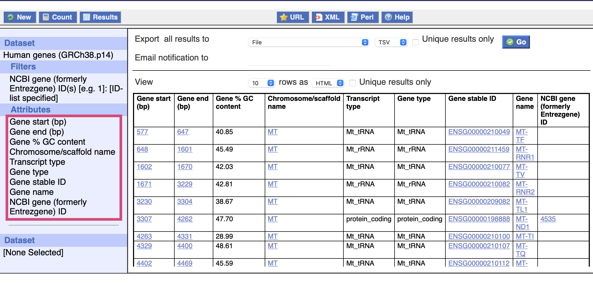
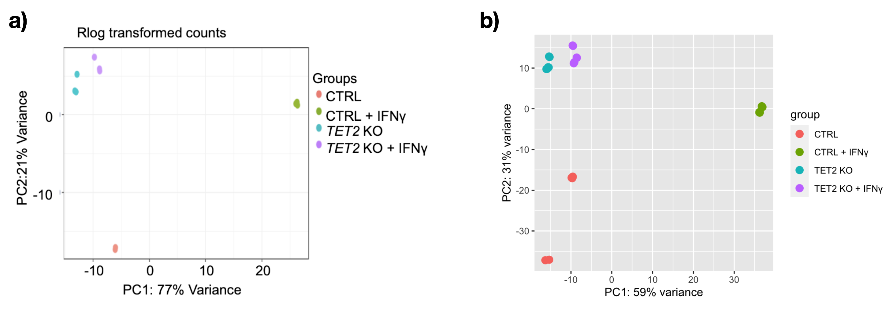
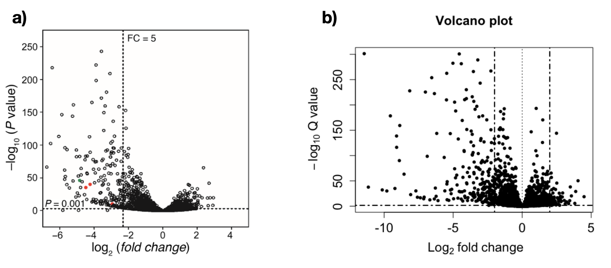

# W1: RNA-seq differential expression analysis. HW

 > Task: Identify a data-set related to Monocytes in bulk RNA-seq and run the complete pipeline. Generate a report.

## Overview

Loss-of-function mutations in genes encoding TET DNA dioxygenase occur frequently in hematopoietic malignancy, but rarely in solid tumors, which instead commonly have reduced activity. The authors showed how TET2 mediates the IFN-γ/JAK/STAT signaling pathway to control chemokine and PD-L1 expression, lymphocyte infiltration, and cancer immunity. 

They studied THP-1 (human monocytic cell line derived from an acute monocytic leukemia patient) and deleted Tet2 using CRISPR/Cas9 (Tet2-KO).They demostrated that the loss of TET2 alters IFN-γ transcriptome.

Dataset: **GSE132408**  
Paper: **Tumor suppressor TET2 promotes cancer immunity and immunotherapy efficacy**
https://doi.org/10.1172/JCI129317.

THP-1 = human monocytic cell line derived from an acute monocytic leukemia patient.  
Tet2-KO =  THP-1 cells with Tet2 deleted using CRISPR/Cas9   


|             |                     Description                     |                                      Samples                                     |
|:-----------:|:---------------------------------------------------:|:--------------------------------------------------------------------------------:|
|    **CL**   |                    THP-1 control                    | GSM3862914<br>GSM3862915<br>GSM3862916<br>GSM3862917<br>GSM3862918<br>GSM3862919 |
| **CL.IFNG** | THP-1 control<br>treated with <br>IFN-γfor 20 hours | GSM3862920<br>GSM3862921<br>GSM3862922<br>GSM3862923<br>GSM3862924<br>GSM3862925 |
|    **KO**   |                       TET2-KO                       | GSM3862926<br>GSM3862927<br>GSM3862928<br>GSM3862929<br>GSM3862930<br>GSM3862931 |
| **KO.IFNG** |    TET2-KO<br>treated with <br>IFN-γfor 20 hours    | GSM3862932<br>GSM3862933<br>GSM3862934<br>GSM3862935<br>GSM3862936<br>GSM3862937 |
GSM5942363
GSM5942364
GSM5942365
GSM5942366
GSM5942367
GSM5942368
GSM5942369
GSM5942370
GSM5942371
GSM5942372

## Workflow

### 1. Retreive data and metadata
1. Download counts from https://www.ncbi.nlm.nih.gov/geo/query/acc.cgi?acc=GSE132408 -> `🔵GSE132408_count`
2. Using `GEOquery` we downlaod the metadata dor GSE132408 -> `🟡Meta_GSE132408`

### 2. Prep input for NOISeq

#### 2.1 Retrieve gene info from BIOMART
1. Save gene names into file  `data/biomart/entrez_id.csv`
2. Query from `BIOMART` https://asia.ensembl.org/info/data/biomart/index.html
    
3. Save the output into a file and read it in R `data/biomart/gene_info_mart_export_2.txt` ->  `🟣annotgene`
4. Rename cols so its easier to understand

### 2.2 QC Filter `🟣annotgene`
5. Filter for chromosomes 1:22,X,Y, remove duplicates and remove na's
    |   **filter<br>**  | **n_rows<br>** | **n_unique<br>** | **n_in_GSE132408_counts<br>** |
    |:-----------------:|:--------------:|:----------------:|:-----------------------------:|
    |      original     |     202690     |       18072      |             18072             |
    | chromosome filter |     194792     |       18062      |             18062             |
    | duplicate removal |      18062     |       18062      |             18062             |


6. Set the column that cointains the entrez id in `🟣annotgene` (annotgene_filt$Entrezgene) as the rowname

#### 2.3 Filter `🔵GSE132408_count` 
7. Filter `🔵GSE132408_count` to only the entrez ids present in `🟣annotgene`
8. Reorder `🟣annotgene` to have the entrez ids in the same order as in `🔵GSE132408_count`. So `🔵GSE132408_count` and `🟣annotgene` contain the same 25,875 genes in the same order

#### 2.4 Extract cols for lenght, GC, biotype and chromosome

9. For the categories (lenght, GC, biotype, chromosome) we need a vector with all the values and entrez id. For chromosome we need ("Chromosome","start","end")

### 3. Run NOISEQ (Explore variability in the data)

```
data_NOISEQ <- readData(data = GSE132408_count_filt,
                        length=lengthuse,
                        gc=gc,
                        biotype= biotype ,
                        chromosome = annotgene_ord[,c("Chromosome","start","end")],
                        factors = Factors_GSE132408)
```

### 4. DESEQ2

1. Make sure rows in sample data `🟡pDataUSE` are in the same order as columns in counts `🔵GSE132408_count_filt`

2. Create DESeqDataSet object
3. QC and Filtering Keeping only rows with at least 10 reads
`11192/18062`
4. Relevel factors make sure the reference is correct
5. Run DESeq
6. Explore results


## Results 

In the principal component analysis we observed similar results to the ones reported by Xu et al. with a clear separation between wild type (control) samples and Tet deleted (Tet2-KO) samples. 

Our variance explained from PC1 = 59% and PC2 = 31%  was also somehow similar to the ones reported by the authors (77% and 21% respectevely)

<figure>
     Plot of principal components 1 and 2 from analysis of gene-expression levels (RNA-seq). a) Results from the authors b) Results obtained by me.</figcaption>
</figure>


For the DEG's the authors reported IFN-γ stimulated 677 genes 2-fold or more in CTRL (TET2-WT THP-1 cells), but only 27 genes in TET2-KO cells. In our analysis we obtained 342 and 12 genes respectevely. Is worth poinnting out that the authors did not report their filtering criteria whereas we filtered for reads with more than 10 reads in at least 6 samples (smallest group size).


|                             |     Reported Results     |         My Results        |   |
|:---------------------------:|:------------------------:|:-------------------------:|:-:|
|   CTRL+IFNγ<br>vs<br>CTRL   | 677 genes 2-fold or more | 342 genes 2-fold or more  |   |
| TET2KO+IFNγ<br>vs<br>TET2KO |  27 genes 2-fold or more |  12 genes 2-fold or more  |   |


Additionally, the authors reported 176 genes induced by IFN-γ were downregulated 5-fold or more in TET2-KO cells compared with control cells. Similarly to the authors we obtained a larger amount of genes downregulared in TET2-KO cells
<figure>
     Volcano plot a) presented by the authors b) replicated by me.</figcaption>
</figure>

These results indicate that a large fraction of IFN-γ–induced genes were suppressed by the deletion of TET2, suggesting an important role of TET2 in mediating the IFN-γ signaling pathway.


## Paper Methods 

1. QC
2. Alignment 
    - Index Ref genome: **GRCH37/hg19**
    - Align 

3. Filter BAMs QC
    
4. Quantification **Rsubread**

5. DE analysis **DESeq2** `P < 0.05` 


## References


Xu YP, Lv L, Liu Y, Smith MD, Li WC, Tan XM, Cheng M, Li Z, Bovino M, Aubé J, Xiong Y. Tumor suppressor TET2 promotes cancer immunity and immunotherapy efficacy. J Clin Invest. 2019 Jul 16;129(10):4316-4331. doi: 10.1172/JCI129317. PMID: 31310587; PMCID: PMC6763236.
