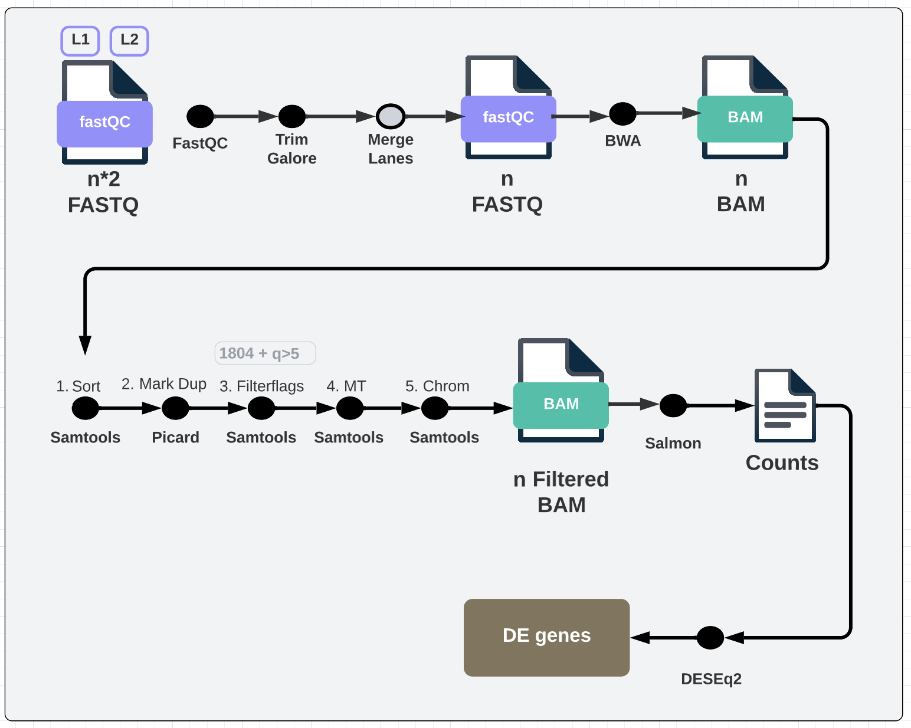

# W1: RNA-seq Pipeline

### Ana Cecilia González Álvarez - 181972


 > Task: Prepare an organized pipeline for RNA-seq.




## 1. QUALITY CONTROL `fastQC` `multiqc`
Check quality of the fastq files using `fastQC`

```bash
module load fastqc

fastqc --outdir out_dir fasta1.fastq.gz fasta2.fastq.gz 
```

Visualize all the results using `multiqc`

```
### Move into the folder where you want your multiqc output 
module load multiqc
multiqc /path_to_your_fastqc_output/
```

## 2. TRIMMING `TrimGalore`
```
module load trim_galore

mkdir -p analysis/Trimming/trim_galore

trim_galore \
  --phred33 \
  --paired \
  --fastqc \
  --cores 3 \
  --output_dir analysis/Trimming/trim_galore \
  S1_fasta1.fastq.gz S1_fasta2.fastq.gz

```

Check the `html` files again! Shouln't have the adapter content anymore 🙂

## 3. ALIGNMENT `BWA`
#### 3.1 For BWA we need to merge lanes manually ❗️
#### 3.2 Download reference genome from either:
- ENSEMBL
- NCBI
- UCSA

To download from ensembl:
1. Go to https://asia.ensembl.org/index.html
2. In **All genomes** Select organism of interest
3. It automatically loads into the newest version
4. In **Gene annotation** click **Download FASTA**
5. Click **dna**
6. We want `.dna.toplevel.fa.gz` (should be the biggest)

#### 3.3 Index > Align > QC

```
bwa index -p bwa ref/genome.fa

bwa mem \
-t 32 \
index/bwa \
S1_fasta1_trimmed.fastq.gz \
S1_fasta2_trimmed.fastq.gz \
2> \
s1.log \
| samtools view -h -b - > s1.bam

## Generate the QC of each sample bam
samtools flagstat -@ 32 s1.bam > s1_flasgstat.log
```

The output of the alignment are bam files (binary form of the Sequence Alignment Map (SAM) files). One for each of my samples 🙂

## 4. FILTER BAMS: QUALITY CHECK

-  First we sort our bam files by genomic position
-  Then we mark the duplicates `-REMOVE_DUPLICATES false`. Only mark don't remove, just because that's the way the NFCORE ATAC pipeline does.
- Then we filter flags 1804 and keep only quality control > 5
- Remove MT reads
- Remove reads not mapped to our known chormosomes

```
samtools sort -@ 6 s1.bam -o s1_sorted.bam

gatk \
MarkDuplicates -I s1_sorted.bam \
 -O s1_sorted_dedup.bam \
 -M s1_sorted_dedup_metrics \
 -VALIDATION_STRINGENCY LENIENT -REMOVE_DUPLICATES false -ASSUME_SORTED true \

samtools view -F 1804 -f 2 -q 5 -hbo s1_sorted_dedup_filt.bam s1_sorted_dedup.bam

samtools view -h s1_sorted_dedup_filt.bam | grep -v "MT" \
| samtools view -h -b \
- > s1_sorted_dedup_filt_noMT.bam

samtools view -b s1_sorted_dedup_filt_noMT.bam 1 2 3 4 5 6 7 8 9 10 11 12 13 14 15 16 17 18 19 20 21 22 23 \
24 25 26 27 28 29 30 31 32 33 34 35 36 37 38 39 W Z \
> s1_sorted_dedup_filt_noMT_cleanchrom.bam

```

#### Stats Quality Control
Also after every step we index and get stats of the new filtered bam file. So we can get an idea of how many reads we are filtering out 


Things we want to check from the stats obtained after each filtering step:
1. **After 1_sort**: Check number of "Mapped Reads" and "Total Reads" to get the percentage of mapped reads
2. **After 2_Mark_Dup**: Number of "Total Dup", and compare it to the "Mapped Reads" to get the % marked duplicates (still in this step we haven't removed anything)
3. **After 3_Filterflags**: New number of "Mapped Reads" after filtering flags, what percentage was removed? 
4. **After 4_MT**: New number of "Mapped Reads" after filtering MT reads, what percentage was removed? 
5. **After 5_Chrom**: New number of "Mapped Reads" after filtering non-chrom reads, what percentage was removed? 

## 5. QUANTIFICATION `salmon`

#### 5.1 Generate transcriptome

```
gffread -w genome_fasta.fa -g annotation.gtf
```

#### 5.2 Run Salmon

```
salmon quant -t genome_fasta.fa --libType A -a s1_sorted_dedup_filt_noMT_cleanchrom.bam -o s1_sorted_dedup_filt_noMT_cleanchrom.salmon_quant --gcBias --seqBias

```


## 6. DIFFERENTIAL EXPRESSION `DESEQ2`

### 1. Load data and metadata
1. Counts is the output from step 5 `🔵counts`
2. For the `🟡metadata`
    - if its published we can download it using `GEOquery` `
    - if not we generate it with each sample info

### 2. Prep input for NOISeq

#### 2.1 Retrieve gene info from BIOMART
1. Save gene names into file  `data/biomart/entrez_id.csv`
2. Query from `BIOMART` https://asia.ensembl.org/info/data/biomart/index.html
    
3. Save the output into a file and read it in R `data/biomart/gene_info_mart_export_2.txt` ->  `🟣annotgene`
4. Rename cols so its easier to understand

#### 2.2 QC Filter `🟣annotgene`
5. Filter for chromosomes 1:22,X,Y, remove duplicates and remove na's

6. Set the column that cointains the entrez id in `🟣annotgene` (annotgene_filt$Entrezgene) as the rowname

#### 2.3 Filter `🔵counts` 
7. Filter `🔵counts` to only the entrez ids present in `🟣annotgene`
8. Reorder `🟣annotgene` to have the entrez ids in the same order as in `🔵counts`. So `🔵counts` and `🟣annotgene` contain the same 25,875 genes in the same order

#### 2.4 Extract cols for lenght, GC, biotype and chromosome

9. For the categories (lenght, GC, biotype, chromosome) we need a vector with all the values and entrez id. For chromosome we need ("Chromosome","start","end")

### 3. Run NOISEQ (Explore variability in the data)

```
data_NOISEQ <- readData(data = counts_filt,
                        length=lengthuse,
                        gc=gc,
                        biotype= biotype ,
                        chromosome = annotgene_ord[,c("Chromosome","start","end")],
                        factors = Factors_GSE198256)
```


### 4. DESEQ2

#### 4.1. Make sure rows in sample data `🟡metadata` are in the same order as columns in counts `🔵counts_filt`

```
all(colnames(🔵counts_filt) == rownames(🟡metadata))
```

#### 4.2. Create DESeqDataSet object

```
dds <- DESeqDataSetFromMatrix(countData = 🔵counts_filt,
                            colData = 🟡metadata,
                            design = ~Group) ##col in 🟡metadata that contains condition
```

#### 4.3. QC and Filtering Keeping only rows with at least 10 reads
```
keep <- rowSums(counts(🔵counts_filt)) >= 10 
dds <- dds[keep,]
```
#### 4.4. Relevel factors make sure the reference is correct
```
dds$Group 
dds$Group <-  relevel(dds$Group, ref = 'REF') 
```

#### 4.5. Run DESeq
```
dds <- DESeq(dds)

```

#### 4.6. Check contrasts
```
resultsNames(dds)
results(dds, contrast = c("Group", "STIM1", "REF"))
results(dds, contrast = c("Group", "STIM2", "REF"))
```

To get summary of up/down regulated on each contrast
```
summary(results(dds, contrast = c("Group", "STIM1", "REF")))
```

Filter for padj or log fold and check how many genes you have now

```
res_1 <- results(dds, contrast =c("Group", "STIM1", "REF"))  
res_1_filt <- res_1[!is.na(res_1$log2FoldChange) & !is.na(res_1$pvalue) &
                            (abs(res_1$log2FoldChange) > 2) &
                            res_1$padj < 0.05, ]
summary(res_1_filt)
```

#### 4.7. Visualize Manhattan Plot
```
plotMA(res_1, ylim=c(-2,2))
```


