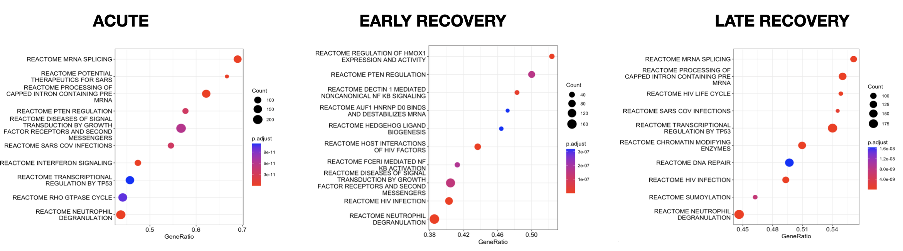

# W2: RNA-seq GSE198256 analysis. 

## Overview

Severe COVID-19 disease is associated with dysregulation of the myeloid compartment during acute infection. To gain further insight into the molecular features of CD14+ monocytes in patients with COVID-19 during acute and convalescent stages, the authors performed global transcriptional profiling.

Dataset: **GSE198256**  
Paper: **Functional reprogramming of monocytes in patients with acute and convalescent severe COVID-19**
https://doi.org/10.1172/jci.insight.154183

|                                      | Number of Samples |                                                                         Samples                                                                        |
|:------------------------------------:|:-----------------:|:------------------------------------------------------------------------------------------------------------------------------------------------------:|
|              **Control**             |         10        | GSM5942339 GSM5942340 GSM5942341 GSM5942342 GSM5942343 GSM5942344 GSM5942345 GSM5942346 GSM5942347 GSM5942348 GSM5942349 |
| **Covid19:  Acute  Infection** |         6         | GSM5942350 GSM5942351 GSM5942352 GSM5942353 GSM5942354 GSM5942355 GSM5942356                                                         |
|    **Covid19: Recovery 3Mo**   |         6         | GSM5942357 GSM5942358 GSM5942359 GSM5942360 GSM5942361 GSM5942362                                                                       |
|    **Covid19: Recovery 6Mo**   |         10        | GSM5942363 GSM5942364 GSM5942365 GSM5942366 GSM5942367 GSM5942368 GSM5942369 GSM5942370 GSM5942371 GSM5942372             

## Results

### Differential Expression Analysis

We compared 3 methods DESeq2, Limma Voom and Limma Trend

We tested 3 disease conditions (Acute, EarlyRecovery, LateRecovery) compared to healthy controls

For the DEG's, for the analysis with DESEQ2 (which the authors also used) we obtained a similar trend in the results - a higher number of DEG in the Acute and Early Recovery samples and a lower number in the Late Recovery - the number of genes we obtained differentially expressed was higher than the number they reported for all the conditions. This could be due to the different gene filtering parameters we set. While we filter for reads with more than 10 reads in at least 6 samples they removed genes with no read count higher than 20 in at least 1 sample. Compared with Limma Trend and Limma Voom we obtained a higher number of DEG for all the conditions both upregulated and downregulared.

Regarding the difference between VOOM and TREND,  we obtained a higher number for the downregulated using VOOM, while when using TREND we obtained a higher number for the upregulated.

|                | **Reported  Results** |      **DESEQ2**     |   **LIMMA VOOM**  |  **LIMMA TREND**  |
|:--------------:|:------------------------:|:-------------------:|:--------------------:|:--------------------:|
|      Acute     |    184 up 155 down    |  418 up 855 down |  332 up 629 down |  651 up 669 down  |
| Early Recovery |    318 up 203 down    | 506 up 4559 down | 1186 up 2086 down | 1852 up 2825 down |
|  Late Recovery |      Hardly any DEGs     |   7 up 64 down   |  402 up 326 down  |  674 up 570 down  |

### Biological Interpretation

We performed GSEA analysis using REACTOME pathways using the LIMMA VOOM results. For Acute samples we observed that the expression of genes associated interferon (IFN) pathway that play a critical role in the human immune response were affected. This is in agreement with what the author reported: immune pathways.

For early recovery samples we observed genes asociated with Nuclear Factor Kappa-B (NF-κB) that eventually leads to the production of inflammatory cytokines and NF-kB activation by FCERI that also results in the synthesis of several cytokines. This is in agreement with what the authos reported: genes encoding chemokines were upregulated, along with important intracellular immunomodulatory proteins and transcription factors. 

|                |                                                              Reported Results                                                              |                            My GSEA Results                           |
|:--------------:|:------------------------------------------------------------------------------------------------------------------------------------------:|:--------------------------------------------------------------------:|
|      Acute     | immune pathways: antigenic presentation, innate immune responses and MAPK and NF-κ B signalling metabolic processes: lipid metabolism |                          Neutrophil degranulation  Interferon (IFN) pathway                         |
| Early Recovery |                              wound healing and chemokine activities intracellular immunomodulatory proteins                             | NFKB activation  Neurotrophil degranulation |

<figure>
     BubbleGUM gene set enrichment analysis (GSEA) map for each disease state.</figcaption>
</figure>

## Paper Methods 

1. QC
2. Trimming:  **Trimmomatic-0.36**  `Truseq3-PE.fa:2:30:10 LEADING:3 TRAILING:3 SLIDINGWINDOW:4:15 MINLEN:36 HEAD- CROP:4`
3. Alignment **STAR_2.5** 
    - Index Ref genome:GRCh38
    - Align with default parameters

4. Filter BAMs QC
    - Sort by chromosome
    - Index BAM
    - Remove reads that align to more than one location **HTSeq-0.9.1** `--nonunique all`

5. Quantification and QC
    - Genes with no raw read count greater or equal to 20 in at least 1 sample **R**

6. DE analysis
    - Normalization
    - DE **DESeq2** `P < 0.05` and `|log2 > 1|`

## References

Functional reprogramming of monocytes in patients with acute and convalescent severe COVID-19
Elisa Brauns, Arnaud Marchant, Stanislas Goriely
Published April 5, 2022 
Citation Information: JCI Insight. 2022;7(9):e154183. https://doi.org/10.1172/jci.insight.154183.

