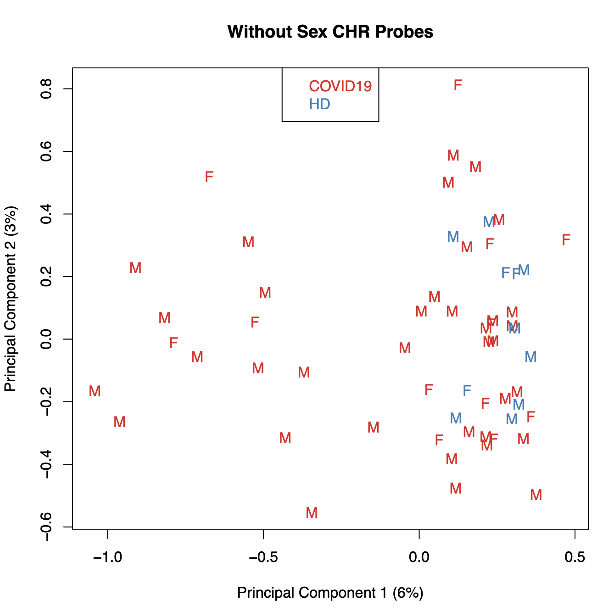

# W7 Methylation
### Assignment Group 3:
This document presents an analysis workflow of DNA methylation dataset in blood monocytes of severe COVID-19 patients. 

## Paper
Godoy-Tena, G., Barmada, A., Morante-Palacios, O. et al. Epigenetic and transcriptomic reprogramming in monocytes of severe COVID-19 patients reflects alterations in myeloid differentiation and the influence of inflammatory cytokines. Genome Med 14, 134 (2022). https://doi.org/10.1186/s13073-022-01137-4

## Cohort and workflow for monocyte purification 
DNA methylome of peripheral blood monocytes from severe COVID-19 patients and healthy donors. Monocytes were hybridized on MethylationEPIC BeadChip arrays.


## Workflow

### QC
#### 1. Load libraries
```
library(knitr)
library(limma)
library(minfi)
library(IlluminaHumanMethylationEPICanno.ilm10b4.hg19)
library(IlluminaHumanMethylationEPICmanifest)
library(RColorBrewer)
library(missMethyl)
library(minfiData)
library(Gviz)
library(DMRcate)
library(stringr)

```

#### 2. Load the data
```
# set up a path to the data directory
setwd("/Users/kurowsaa/OneDrive/Documents/KAUST/BESE394E_homework/BESE394E_course/WEEK_7/")
dataDirectory <- "data/GSE188573_RAW 2"

# list the files
files <- list.files(dataDirectory, recursive = TRUE)

# read in the sample sheet for the experiment
targets <- read.metharray.sheet(dataDirectory, pattern="Data_sheet.csv")

targets$Basename <- unique(sub('data/GSE188573_RAW 2/', '', targets$Basename))

# Read the data
rgSet <- read.metharray.exp(base = dataDirectory, targets = targets)

# give the samples descriptive names
targets$Sample_Group <- gsub("Healthy Donor", "HD", targets$Sample_Group)
targets$ID <- paste0(targets$Sample_Group,".", targets$Sample_Name)
sampleNames(rgSet) <- targets$ID
```

#### 3. Calculate the detection p-values
We can generate a detection p-value for every CpG in every sample, which is indicative of the quality of the signal. The method used by *minfi* to calculate detection p-values compares the total signal (M+U) for each probe to the background signal level, which is estimated from the negative control probes. Very small p-values are indicative of a reliable signal whilst large p-values, for example >0.01, generally indicate a poor quality signal.
M - methylated intesity at CpG locus
U - unmethylated intensity at CpG locus
```
detP <- detectionP(rgSet, type = "m+u")

# examine mean detection p-values across all samples to identify any failed samples
png("barplot.png", height = 100, width = 150, units = "mm", res = 600)
pal <- brewer.pal(8,"Dark2")
barplot(colMeans(detP), col=pal[factor(targets$Sample_Group)], las=2, 
        cex.names=0.4, ylim=c(0,0.0005), ylab="Mean detection p-values")
abline(h=0.05,col="red")
legend("topleft", legend=levels(factor(targets$Sample_Group)), fill=pal, 
       bg="white")
dev.off()

# check for poor quality samples, below 0.05 threshold
keep <- colMeans(detP) < 0.05 # keeping all of the samples

# remove poor quality samples
rgSet <- rgSet[,keep]

# remove poor quality samples from targets data
targets <- targets[keep,]

# generate other quality control plots
qcReport(rgSet, sampNames=targets$ID, sampGroups=targets$Sample_Group, 
         pdf="qcReport.pdf")
```


#### 4. Normalization
We will apply the **preprocessQuantile** method to our data. This function implements a stratified quantile normalisation procedure which is applied to the methylated and unmethylated signal intensities separately, and takes into account the different probe types. The M and U intensity information are converted to M-values and beta values, together with associated genomic coordinates. 
```
# normalize the data; this results in a GenomicRatioSet object
mSetSq <- preprocessQuantile(rgSet) 

# create a MethylSet object from the raw data for plotting
mSetRaw <- preprocessRaw(rgSet)

# visualise what the data looks like before and after normalization
png("normalization.png", height = 200, width = 100, units = "mm", res = 600)
par(mfrow=c(1,2))
densityPlot(rgSet, sampGroups=targets$Sample_Group,main="Raw", legend=FALSE)
legend("top", legend = levels(factor(targets$Sample_Group)), 
       text.col=brewer.pal(8,"Dark2"))
densityPlot(getBeta(mSetSq), sampGroups=targets$Sample_Group,
            main="Normalized", legend=FALSE)
legend("top", legend = levels(factor(targets$Sample_Group)), 
       text.col=brewer.pal(8,"Dark2"))
dev.off()
```


#### 5. Data exploration
```
# MDS plots to look at largest sources of variation

png("mds.png", width = 100, height = 100, units = "mm", res = 600)
plotMDS(getM(mSetSq), top=1000, gene.selection="common", labels = NULL,
        col=pal[factor(targets$Sample_Group)], cex = 0.5)
legend("top", legend=levels(factor(targets$Sample_Group)), text.col=pal,
       bg="white", cex=0.7)
dev.off()
```


#### 6. Filtering
Poor performing probes are generally filtered out prior to differential methylation analysis. As the signal from these probes is unreliable, by removing them we perform fewer statistical tests and thus incur a reduced multiple testing penalty. We filter out probes that have failed in one or more samples based on detection p-value.
Additionally we filter out probes at SNPs as well as sex chromosomes.
```
# ensure probes are in the same order in the mSetSq and detP objects
detP <- detP[match(featureNames(mSetSq),rownames(detP)),] 

# remove any probes that have failed in one or more samples
keep <- rowSums(detP < 0.01) == ncol(mSetSq) 
table(keep)

mSetSqFlt <- mSetSq[keep,]
mSetSqFlt

#keep
#FALSE   TRUE 
##6849 859010

# remove probes with SNPs at CpG site
mSetSqFlt <- dropLociWithSnps(mSetSqFlt)
mSetSqFlt

# Remove probes on the sex chromosomes
# creating the annotation
annEPIC <- getAnnotation(IlluminaHumanMethylationEPICanno.ilm10b4.hg19)

keep <- !(featureNames(mSetSqFlt) %in% annEPIC$Name[annEPIC$chr %in% c("chrX","chrY")])
table(keep)
#keep
#FALSE   TRUE 
#18683 811890 
mSetSqFlt <- mSetSqFlt[keep,]

# plot MDS after filtering
png("mda_filter_norm.png", width = 100, height = 100, units = "mm", res = 600)
plotMDS(getM(mSetSqFlt), top=1000, gene.selection="common", labels = NULL,
        col=pal[factor(targets$Sample_Group)], cex = 0.5)
legend("top", legend=levels(factor(targets$Sample_Group)), text.col=pal,
       bg="white", cex=0.7)
dev.off()
```


#### 6. Probe-wise differential methylation analysis
```
# calculate M-values for statistical analysis
mVals <- getM(mSetSqFlt)

bVals <- getBeta(mSetSqFlt)

#Plotting m and b values
png("m-b-values.png", width = 200, height = 100, units = "mm", res = 600)
par(mfrow=c(1,2))
densityPlot(bVals, sampGroups=targets$Sample_Group, main="Beta values", 
            legend=FALSE, xlab="Beta values")
legend("top", legend = levels(factor(targets$Sample_Group)), 
       text.col=brewer.pal(8,"Dark2"))
densityPlot(mVals, sampGroups=targets$Sample_Group, main="M-values", 
            legend=FALSE, xlab="M values")
legend("topleft", legend = levels(factor(targets$Sample_Group)), 
       text.col=brewer.pal(8,"Dark2"))
dev.off()
```


```
cellType <- factor(targets$Sample_Group, levels = c('HD', 'COVID19'))

# create a design matrix
design <- model.matrix(~ 0 + cellType, data = targets)
colnames(design) <- gsub("cellType", "", colnames(design))

# create a contrast matrix for specific comparisons
contMatrix <- makeContrasts(COVID19-HD,
                            levels=design)
# linear model
fit <- lmFit(mVals, design)

# fit the contrasts
fit2 <- contrasts.fit(fit, contMatrix)
fit2 <- eBayes(fit2)

#COVID19 - HD
#Down          14334
#NotSig       776658
#Up            20898

# get the table of results for the first contrast (COVID19 - HD)
annSub <- annEPIC[match(rownames(mVals),annEPIC$Name),
                      c(1:4,12:19,24:ncol(annEPIC))]
# DMP results
DMPs <- topTable(fit2, num=Inf, coef=1, genelist=annSub)
write.table(DMPs, file="DMPs.csv", sep=",", row.names=FALSE)

# plot the top 4 most significantly differentially methylated CpGs 
png("DMP.png", width = 200, height = 200, units = "mm", res = 600)
par(mfrow=c(2,2))
sapply(rownames(DMPs)[1:4], function(cpg){
  plotCpg(bVals, cpg=cpg, pheno=targets$Sample_Group, ylab = "Beta values")
})
dev.off()
```


Plot the top 4 most significantly differentially methylated CpGs

```
par(mfrow=c(2,2))
sapply(rownames(DMPs)[1:4], function(cpg){
  plotCpg(bVals, cpg=cpg, pheno=targets$Sample_Group, ylab = "Beta values")
})
```


#### 7. Differential methylation analysis of regions

```
myAnnotation <- cpg.annotate(object = mVals, datatype = "array", what = "M", 
                             analysis.type = "differential", design = design, 
                             contrasts = TRUE, cont.matrix = contMatrix, 
                             coef = "COVID19 - HD", arraytype = "EPIC")

DMRs <- dmrcate(myAnnotation, lambda=1000, C=2)
results.ranges <- extractRanges(DMRs)
results.ranges

DMR.plot(ranges = results.ranges, dmr = 2, CpGs = bVals, phen.col = cols, 
         what = "Beta", arraytype = "450K", genome = "hg19")
```


#### 8. Gene Ontology Testing
```
sigCpGs <- DMPs$Name[DMPs$adj.P.Val<0.05]
sigCpGs[1:10]# First 10 significant CpGs
```
```
 [1] "cg19938920" "cg01995927" "cg19800370" "cg21200735" "cg23698960"
 [6] "cg24518693" "cg19711949" "cg11099984" "cg22434506" "cg25392060"
```

```
> length(sigCpGs)
[1] 35232
> length(all)
[1] 811890
```

```
par(mfrow=c(1,1))
gst <- gometh(sig.cpg=sigCpGs, all.cpg=all, plot.bias=TRUE)
```


```
topGSA(gst, number=10)
           ONTOLOGY                                             TERM    N  DE
GO:0006955       BP                                  immune response 1558 606
GO:0002376       BP                            immune system process 2316 869
GO:0001775       BP                                  cell activation 1037 442
GO:0045321       BP                             leukocyte activation  896 390
GO:0002684       BP     positive regulation of immune system process  954 392
GO:0046649       BP                            lymphocyte activation  734 321
GO:0002252       BP                          immune effector process  595 254
GO:0002682       BP              regulation of immune system process 1393 524
GO:0002250       BP                         adaptive immune response  424 190
GO:0002366       BP leukocyte activation involved in immune response  273 136
                   P.DE          FDR
GO:0006955 2.113932e-27 4.810040e-23
GO:0002376 2.957571e-26 3.364829e-22
GO:0001775 1.549019e-21 1.174880e-17
GO:0045321 3.378382e-21 1.921793e-17
GO:0002684 3.818302e-18 1.737633e-14
GO:0046649 2.917340e-17 1.106353e-13
GO:0002252 8.397395e-16 2.729633e-12
GO:0002682 1.913517e-15 5.442520e-12
GO:0002250 8.032436e-15 2.030778e-11
GO:0002366 9.347133e-15 2.126847e-11
```


#### 9. Differential variability

```
detP <- detectionP(rgSet, type = "m+u")
mSetSq <- preprocessQuantile(rgSet)


targets$Sex <- getSex(mSetSq)$predictedSex
detP <- detP[match(featureNames(mSetSq),rownames(detP)),]

keep <- rowSums(detP < 0.01) == ncol(detP) 
mSetSqFlt <- mSetSq[keep,]
mSetSqFlt <- dropLociWithSnps(mSetSqFlt, snps = c("CpG", "SBE"))

plotMDS(getM(mSetSqFlt[keep,]), top=1000, gene.selection="common", 
        col=pal[factor(targets$Sample_Group)], labels=targets$Sex, 
        main="Without Sex CHR Probes")
```


```
# get M-values for analysis
mVals <- getM(mSetSqFlt)

design <- model.matrix(~factor(targets$Sample_Group)) 
fitvar <- varFit(mVals, design = design, coef = c(1,2))

# Summary of differential variability
summary(decideTests(fitvar))
```

```
       (Intercept) factor(targets$Sample_Group)HD
Down             0                              4
NotSig          19                         811571
Up          811871                            315
```

```
> topDV
           SampleVar LogVarRatio DiffLevene         t      P.Value  Adj.P.Value
cg20648333 0.3908892    3.528779  0.9369662 10.030155 2.137160e-17 1.225645e-11
cg23595055 0.5285544    3.468363  1.0331636  9.966223 3.019238e-17 1.225645e-11
cg03224850 0.2092742    3.001342  0.6427816  9.809438 7.041563e-17 1.905658e-11
cg04407652 0.3877536    2.464585  0.7644776  7.270409 4.643592e-11 9.425215e-06
cg05705964 0.2684289    2.494302  0.6564096  6.960904 2.206348e-10 3.582624e-05
cg15208524 0.9892284    1.692495  1.0686443  6.616197 1.214440e-09 1.329315e-04
cg18113826 0.4191358    2.931363  0.7638115  6.727624 1.255020e-09 1.329315e-04
cg08362785 0.1860853    2.647454  0.3451952  6.970600 1.309847e-09 1.329315e-04
cg04877503 0.3848094    1.756546  0.6476104  6.546905 1.703911e-09 1.399919e-04
cg20376123 0.1344428    1.931515  0.4186472  6.544468 1.724272e-09 1.399919e-04
```


### Biological Interpretation

1. **Differential Methylation Patterns**: The analysis identified significant methylation differences at sites like cg19938920 and cg01995927, located in genes involved in immune modulation. These epigenetic changes may alter gene expression, potentially leading to the abnormal immune responses observed in severe COVID-19 patients, affecting monocyte function and contributing to inflammation. Gene Ontology Testing: Gene Ontology results highlight significant enrichment in pathways like "immune response" and "leukocyte activation," suggesting that epigenetic modifications in severe COVID-19 could prime leukocytes towards a hyperactivated state. This hyperactivation could exacerbate inflammation and tissue damage in these patients.

2. **Differential Variability in Methylation**: The findings show higher methylation variability at certain CpGs in COVID-19 patients, such as cg20648333 and cg23595055, indicating a dynamic epigenetic response to infection. This variability might affect gene regulation, influencing how monocytes respond to the disease and contributing to the severity of the infection.

3. **Potential Impact on Monocyte Differentiation**: Methylation changes observed could impact monocyte differentiation, possibly skewing the development towards more inflammatory subtypes or those less capable of resolving inflammation. This shift could play a crucial role in the pathology of severe COVID-19, affecting how the immune system responds to the virus.